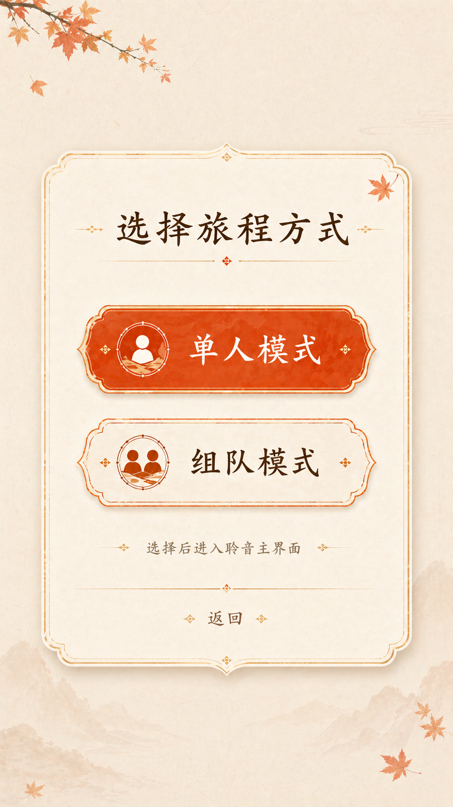
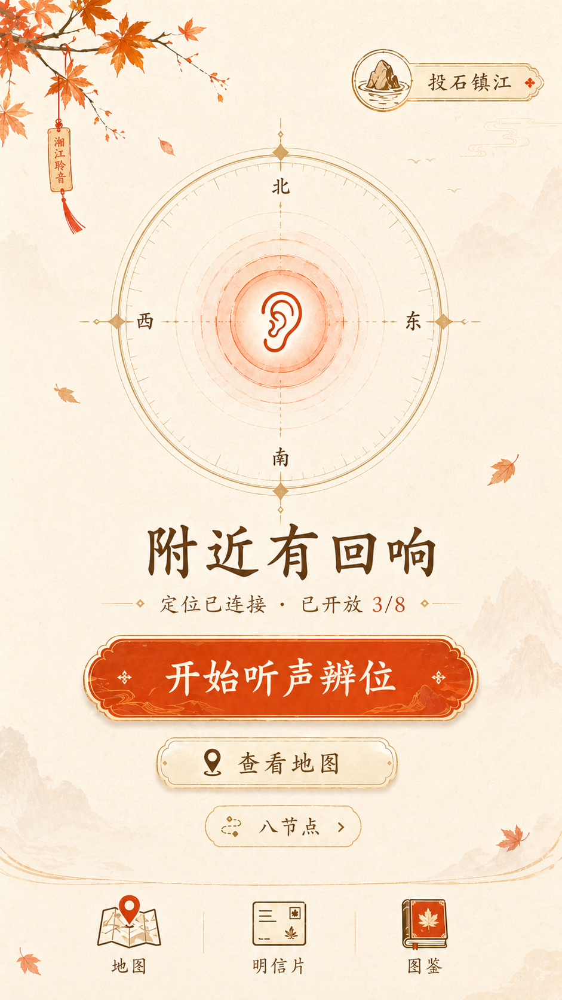
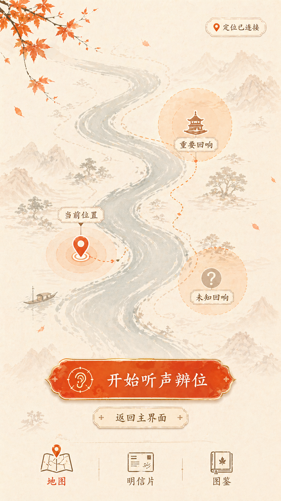
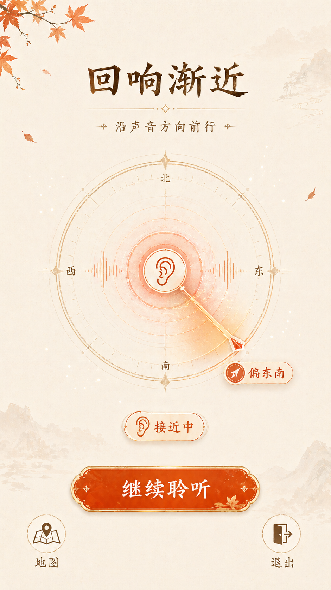
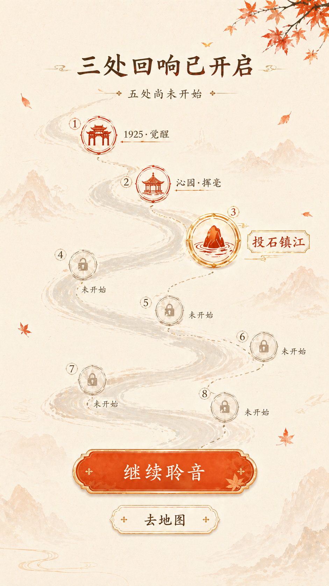
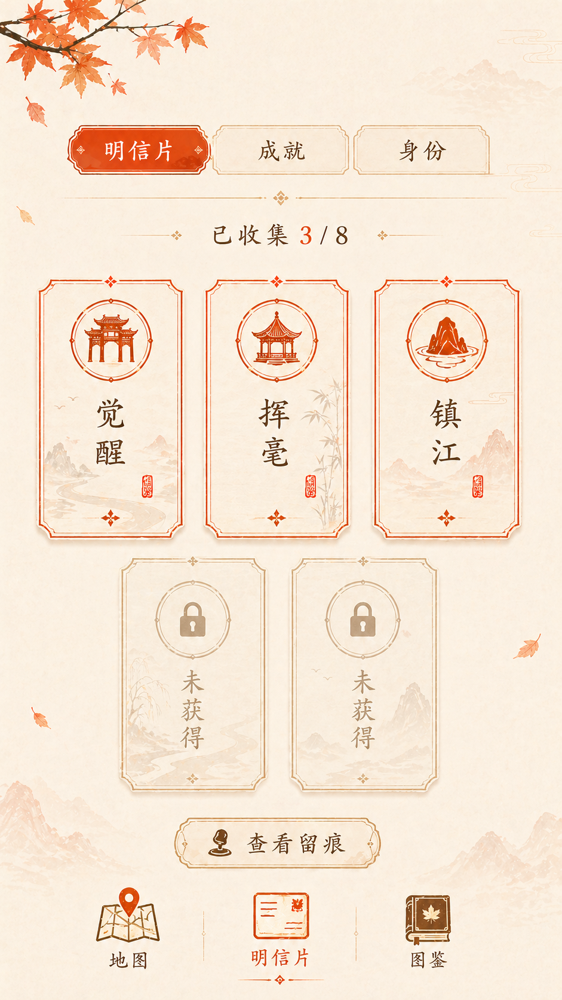
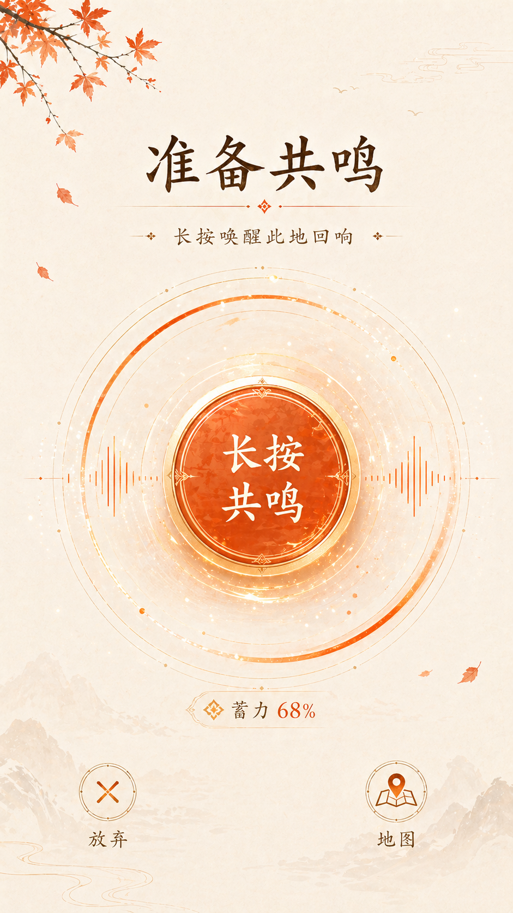
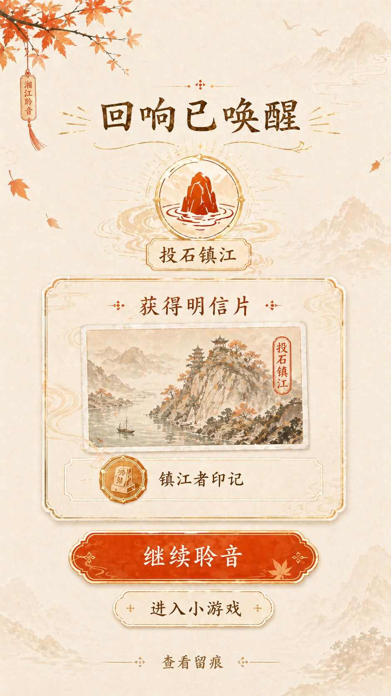
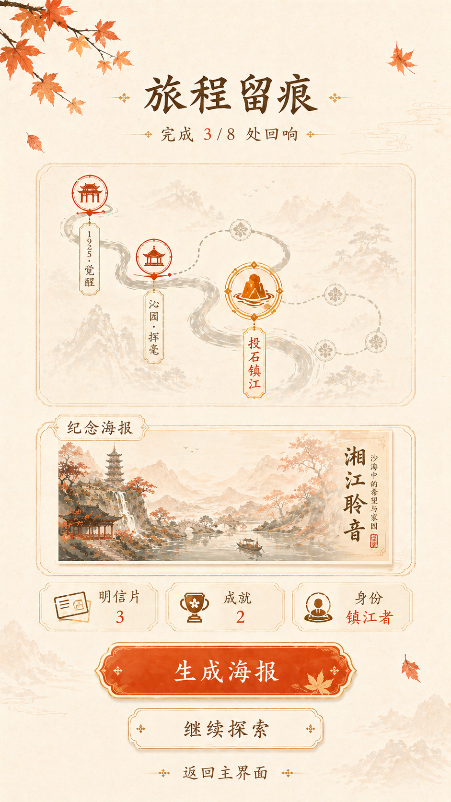

# 湘江聆音高保真页面套图

这一套图按当前页面层级生成，用于确认主界面、地图、听声辨位、八节点、留痕图鉴、共鸣、节点完成和结算留痕的视觉方向。

风格关键词：极简国风、米白纸感、淡山水背景、鲜艳橘红控件、金色描边、深茶褐文字。

## 页面清单

1. 模式选择弹窗
   

2. 主界面
   

3. 地图页
   

4. 听声辨位页
   

5. 八节点总览页
   

6. 留痕图鉴页
   

7. 共鸣页
   

8. 节点完成页
   

9. 结算留痕页
   
