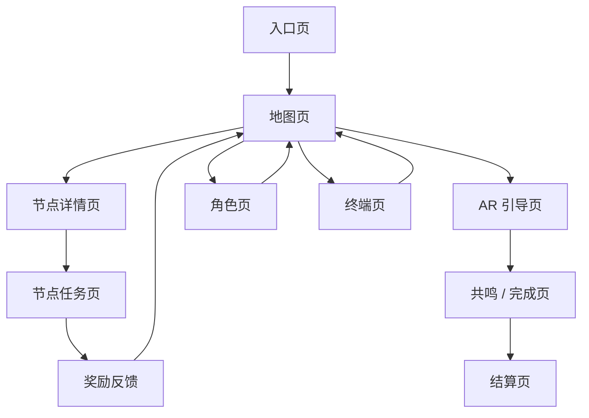

# 页面原型说明：湘江文旅小游戏移动端

整理日期：2026-04-25  
基准画布：390 x 844  
目标：把现有入口、地图、节点、AR、角色、终端、结算页整理为中保真页面结构，供 UI 绘制和前端拆分使用。

## 1. 全局页面框架

除首页和 AR 全屏层外，普通页面统一使用：

1. 背景层：暖纸色 + 轻江景纹理。
2. 顶部信息区：模块标签、页面标题、状态标签、说明句。
3. 主内容区：当前页面唯一核心任务。
4. 底部操作区：主按钮 / 次按钮。
5. 固定底部导航：主页、地图、角色、终端。

用户在任意普通页面都应能通过底部导航回到地图、角色或终端。进入 AR 层后，底部导航隐藏，只保留关闭按钮。

## 2. 页面流

## 3. 入口页

### 页面目标

让用户知道这是一次橘子洲/湘江文旅小游戏，并开始旅程。

### 页面结构

- 背景：复用首页背景图。
- 标题：复用现有标题字图。
- 主菜单：开始游戏、继续旅程、设置选项、成就图鉴。
- 不显示底部导航。

### 主按钮

- 开始游戏：进入地图页。
- 继续旅程：进入上次停留页面；没有记录时进入地图页。

### 状态

- 默认：显示四个入口按钮。
- 继续旅程不可用：按钮保留，但进入地图页并提示“暂无历史旅程，已为你开启新旅程”。

## 4. 地图页

### 页面目标

让用户判断当前位置、可进入节点和下一步路线。

### 页面结构

- 顶部信息区：`区域地图 / 橘洲节点地图 / 定位状态标签`。
- 地图区：路线轮廓、节点 marker、当前位置提示。
- 节点列表：每个节点显示名称、距离、状态、任务摘要。
- 底部操作：定位并刷新地图、继续主线。

### 主按钮

- 定位并刷新地图：触发定位。
- 继续主线：进入 AR 引导或当前主线阶段。

### 状态

- 未定位：显示演示点位和“定位并刷新地图”。
- 定位中：按钮 loading，节点列表保持可读。
- 真实定位：显示真实定位标签。
- 无可进入节点：节点按钮置灰，提示靠近后可进入。
- 有可进入节点：对应节点按钮可点击，进入节点详情。

## 5. 节点详情页

### 页面目标

让用户决定是否参加该节点任务。

### 页面结构

- 顶部信息区：`节点详情 / 节点名 / 可跳过`。
- 节点摘要：地点说明、文化线索、奖励预览。
- 任务预览卡：目标数量、预计时长、奖励。
- 操作区：开始节点任务、跳过此节点任务、返回地图。

### 主按钮

- 开始节点任务：进入节点任务页。

### 返回路径

- 返回地图：不改变节点状态。
- 跳过任务：标记为已跳过，回到地图页。

### 状态

- 可开始：主按钮可用。
- 不可进入：主按钮置灰，说明距离过远。
- 已跳过：显示“已跳过”，允许重新进入详情。
- 已完成：显示奖励摘要，不再显示开始按钮。

## 6. 节点任务页

### 页面目标

让用户完成当前节点的轻量任务，并获得明确奖励反馈。

### 页面结构

- 顶部信息区：`节点任务 / 任务名 / 收集中`。
- 目标清单：3 个目标，每项有未完成/已完成状态。
- 操作区：每个目标对应独立按钮，例如“拍摄老码头”。
- 完成反馈：任务完成后显示明信片预览。
- 返回按钮：返回地图。

### 主按钮

- 未完成时：目标按钮是主操作。
- 完成后：返回地图。

### 状态

- 收集中：目标按钮可点击。
- 单项完成：对应目标变为完成态，按钮置灰。
- 全部完成：显示奖励卡。
- 退出确认：如果中途返回，提示进度是否保留。

## 7. AR 引导页

### 页面目标

让用户根据方向提示靠近主线目标区域。

### 页面结构

- 全屏深色/摄像头画面。
- 顶部左侧：AR 引导标签。
- 顶部右侧：关闭按钮。
- 中央：扫描框和粒子方向。
- 状态提示：方向文案、偏角、声强。
- 调试面板：默认收起。

### 主按钮

AR 页不使用底部主按钮；交互以手机方向、摄像头和关闭按钮为主。

### 状态

- seeking：提示向左/向右。
- aligning：提示微调。
- locked：提示目标已锁定。
- lost：提示信号中断，建议重新对准环境。
- 权限失败：显示 Demo mode 或权限说明。

## 8. 共鸣 / 完成页

### 页面目标

让用户完成到点确认，看到清晰反馈。

### 页面结构

- 顶部信息区：`共鸣动作 / 与此地共鸣 / 仪式中`。
- 中央长按按钮。
- 进度条：横向充能。
- 完成后：显示“此地回应了你”和奖励。
- 操作区：继续主线、查看说明。

### 状态

- 未按住：按钮静止。
- 按住中：进度条增长，按钮反馈增强。
- 完成：跳转节点完成页或下一主线阶段。

## 9. 角色页

### 页面目标

展示玩家身份、头像、等级、完成节点和收集进度。

### 页面结构

- 角色头像区：头像、昵称、身份称号。
- 统计区：等级、完成节点、明信片、成就。
- 身份说明：镇江者/拾遗者/燃火者的核心属性。
- 返回路径：底部导航回地图或主页。

### 状态

- 默认头像：显示“湘”字占位。
- 已上传头像：显示头像。
- 未选择身份：显示身份选择入口。
- 已选择身份：显示身份能力和当前成长。

## 10. 终端页

### 页面目标

管理玩家信息、成就、明信片收藏和系统设置。

### 页面结构

- 玩家档案卡：头像、昵称、称号。
- 基础信息：昵称输入、头像上传。
- 探索概况：等级、完成节点、明信片、成就。
- 成就列表：空态或标签列表。
- 明信片收藏：空态或卡片列表。
- 系统设置：定位模式、重置头像、返回当前页面。

### 状态

- 无成就：提示先完成节点任务。
- 有成就：展示成就标签。
- 上传失败：显示错误提示，不更新头像。
- 有明信片：展示明信片卡片。

## 11. 最终结算页

### 页面目标

让用户看到本次旅程结果，并产生分享或复游动机。

### 页面结构

- 顶部信息区：`终章留痕 / 湘江已记住你的回应 / 终章`。
- 旅程总结：身份、完成节点、奖励。
- 明信片或海报预览。
- 操作区：分享明信片、重新开始、查看终端。

### 状态

- 无奖励：显示“尚未获得明信片”，引导返回地图补任务。
- 有奖励：显示明信片预览。
- 分享成功：提示已复制或已调用系统分享。
- 分享失败：提供复制文案兜底。

## 12. 中保真检查清单

- 每页都有明确标题和状态标签。
- 每页只有一个最强主动作。
- 返回路径始终可见或可推断。
- 小屏 360px 下按钮文字不换行挤压。
- 任务完成前后页面状态明显不同。
- AR 页关闭按钮始终在右上角可点击。
- 结算页不再展示复杂地图列表，只展示结果和分享。

