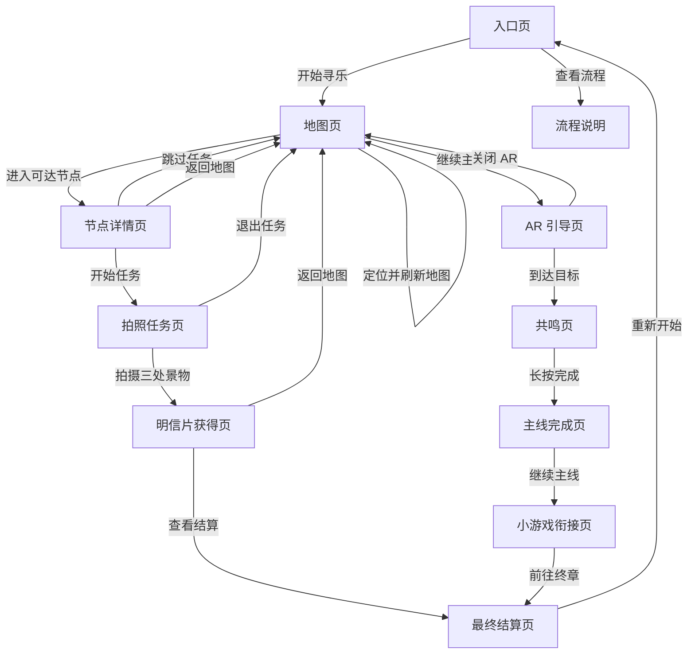

# 用户体验地图：定位地图与节点任务流程

## 目标

把当前“所有内容堆在一个主卡片里”的原型，拆成更清晰的页面跳转体验。用户应该先理解自己在哪个页面、下一步要做什么，再决定是否进入节点任务、AR 引导或主线推进。

本轮前端调整建议：撤掉顶部横向进度条，不再用 7 段条表达流程。改用页面标题、状态标签、主按钮、返回按钮和任务卡片表达当前阶段。

## 页面分级

### 1. 入口页

用户目标：理解这是一次湘江/橘子洲的移动端体验，并开始旅程。

页面主内容：
- 项目标题与一句体验说明
- “开始寻乐”主按钮
- “查看流程”次按钮

跳转：
- 开始寻乐 -> 地图页
- 查看流程 -> 流程说明弹层或独立说明页

### 2. 地图页

用户目标：看到当前位置、可进入节点、不可进入节点，并选择下一步。

页面主内容：
- 定位状态：等待定位 / 定位中 / 真实定位已连接 / 演示定位
- 地图区域：节点 marker，不展示主流程进度条
- 节点列表：每个节点显示距离、可进入状态、任务摘要
- 底部主按钮：继续主线

跳转：
- 定位并刷新地图 -> 留在地图页，刷新节点状态
- 点击可进入节点 -> 节点详情页
- 继续主线 -> AR 引导页或到点确认页

### 3. 节点详情页

用户目标：决定是否参与该节点任务。

页面主内容：
- 节点名称、位置说明、任务奖励预览
- 任务说明：对三处景物进行拍照
- 明确的非强制选择：开始任务 / 跳过任务

跳转：
- 开始任务 -> 拍照任务页
- 跳过任务 -> 返回地图页，并标记“已跳过”
- 返回地图 -> 地图页

### 4. 拍照任务页

用户目标：完成该节点内三处景物的拍照收集。

页面主内容：
- 三个拍照目标清单
- 每个目标独立按钮或相机入口
- 任务进度用清单完成状态表达，不用全局进度条
- 完成后展示明信片奖励卡

跳转：
- 拍摄目标 -> 留在拍照任务页，更新目标状态
- 三个目标完成 -> 明信片获得页
- 跳过/退出 -> 返回节点详情或地图页

### 5. AR 引导页

用户目标：根据方向提示靠近主线目标区域。

页面主内容：
- 全屏 AR / 摄像头画面
- 方向提示、声音提示、调试入口
- 退出 AR 按钮

跳转：
- 关闭 AR -> 地图页
- 到达目标 -> 到点确认页

### 6. 到点确认 / 共鸣页

用户目标：完成主线节点确认动作。

页面主内容：
- 到点确认说明
- 长按共鸣按钮
- 共鸣状态反馈

跳转：
- 共鸣完成 -> 主线完成页
- 返回地图 -> 地图页

### 7. 主线完成页

用户目标：获得清晰完成反馈，并选择继续或查看奖励。

页面主内容：
- 节点完成反馈
- 当前获得的奖励摘要
- 继续主线按钮

跳转：
- 继续主线 -> 小游戏衔接页
- 查看明信片 -> 明信片页

### 8. 最终结算页

用户目标：看到本次旅程结果，分享明信片或重新开始。

页面主内容：
- 旅程完成文案
- 明信片结算图
- 已完成/已跳过的节点摘要
- 分享明信片按钮
- 重新开始按钮

跳转：
- 分享明信片 -> 系统分享或分享文案提示
- 重新开始 -> 入口页

## 推荐跳转图

## 当前界面问题与调整原则

- 当前问题：入口、地图、节点任务、API 联调、AR 引导、结算奖励都在同一张主卡片里，用户难以判断主次。
- 调整原则：一个页面只服务一个主要动作；地图页只负责定位和选点，节点详情页只负责是否进入任务，拍照任务页只负责完成三处景物。
- 当前问题：进度条占据视觉注意力，但不能解释“我该点哪里”。
- 调整原则：撤掉全局进度条；用页面标题、状态标签、按钮文案和任务清单表达进展。
- 当前问题：节点任务像附属模块，不像页面跳转。
- 调整原则：进入节点后应该切换到独立节点详情/任务视图，而不是在同一页继续追加内容。

## 下一步前端改造顺序

1. 撤掉 `stage-strip` 进度条。
2. 把地图节点系统从主卡片中提升为独立“地图页”。
3. 把节点任务面板改成“节点详情页 -> 拍照任务页”的两级跳转。
4. 最终结算页只保留结果、明信片和分享，不再展示地图节点列表。
5. 保留测试覆盖：入口到地图、地图到节点、节点跳过、拍照完成、结算展示。
