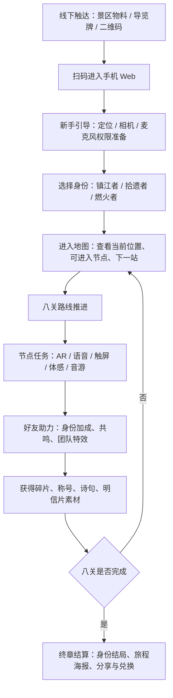

---
tags:
  - xiang-river
  - game-flow
  - mainline
  - ppt
---

# 游戏全流程

## Links

- 上级总览：[[00-主线策划总览]]
- PPT 策划总案：[[31-湘江文旅小游戏策划总案]]
- UI 原型说明：[[02-原型与交互/32-UI中保真页面原型说明]]
- UI 规范文档：[[04-协作与汇报/30-UI规范文档]]

来源：`D:/Wechat/Documents/xwechat_files/wxid_83lzd3ms2w0g22_b2c6/msg/file/2026-04/汇报(2).pptx`  
依据：`docs/game-design-report-ppt.md`  
整理日期：2026-04-26  
文档用途：把 PPT 中的项目定位、三身份、八大关卡、协作机制、奖励结局整理成一条可用于 UI 原型、前端拆分与汇报讲述的完整玩家流程。

## 1. 全流程一句话

游客在橘子洲现场扫码进入手机 Web 小游戏，选择“镇江者 / 拾遗者 / 燃火者”身份后，沿真实景区路线依次完成八个文化节点任务，在 AR 扫描、诗词朗诵、寻宝、非遗修复、水文校准、投石镇江、花鼓戏音游等互动中与同伴协作，最终生成身份分支结局、旅程明信片与可分享纪念。

## 2. 总体流程

## 3. 玩家体验分段

| 阶段 | 玩家目标 | 系统目标 | 关键输出 |
| --- | --- | --- | --- |
| 线下触达 | 知道这里可以玩 | 把游客从静态观光引入互动体验 | 二维码、入口标题、体验承诺 |
| 扫码入场 | 快速进入，不下载 App | 降低启动门槛 | 手机 Web 首页 |
| 权限准备 | 明白为什么要开权限 | 为 LBS、AR、语音任务做准备 | 定位、相机、麦克风状态 |
| 身份选择 | 选一个自己代入的角色 | 建立三身份差异和协作动机 | 镇江者 / 拾遗者 / 燃火者 |
| 地图推进 | 知道我在哪、下一站去哪 | 用路线导流景区点位 | 地图节点、距离、状态 |
| 节点任务 | 完成当前文化互动 | 把文化内容转成可操作玩法 | 任务结果、奖励、剧情片段 |
| 好友助力 | 和同伴一起完成更高评价 | 形成现场社交和传播 | 身份加成、团队特效 |
| 终章结算 | 带走一次可分享记忆 | 完成留存、分享和二消入口 | 结局、明信片、兑换权益 |

## 4. 详细流程

### 4.1 线下触达与扫码入场

玩家在橘子洲入口、游客中心、节点导览牌或活动海报上看到二维码。物料主信息应直接表达“沿江入戏，八景成章”的体验承诺，并提示这是手机 Web 轻量玩法，不需要下载独立 App。

扫码后进入入口页。入口页承担三件事：确认游戏主题、提供“开始旅程 / 继续旅程”主按钮、提示该体验会用到定位、相机和麦克风。老玩家或中途退出玩家应可以恢复进度。

### 4.2 新手引导与权限准备

系统依次请求定位、相机、麦克风权限，并用简短说明告诉玩家每项权限对应的玩法：

| 权限 | 用途 | 拒绝后的兜底 |
| --- | --- | --- |
| 定位 | 判断玩家是否到达真实景点，显示路线距离 | 提供手动选择节点或演示模式 |
| 相机 | AR 扫描建筑、碑刻、景观和道具 | 提供扫码确认或静态识别替代 |
| 麦克风 | 诗词朗诵、口号共鸣、薪火相传 | 提供点击节奏或文本确认替代 |

权限失败不应直接中断游戏。玩家可以先进入地图预览，但需要在节点任务前再次提示开启对应权限。

### 4.3 身份选择与队伍集结

玩家从三种身份中选择一种。身份不是硬性职业限制，而是“全员可玩、身份加成、团队特效”的协作系统。

| 身份 | 核心属性 | 体验气质 | 擅长任务 |
| --- | --- | --- | --- |
| 镇江者 | 定力 | 稳定、守护、镇水 | 投石、校准、物理稳定 |
| 拾遗者 | 通感 | 感知、收集、修复 | AR 寻宝、音游、非遗修复 |
| 燃火者 | 感召 | 朗诵、点火、号召 | 诗词朗诵、火种仪式、口号共鸣 |

如果同队玩家包含三种不同身份，触发“三杰聚首”。全队获得初始属性加成，并在后续任务中解锁更明显的团队特效。单人玩家仍可完成主线，但团队会拥有更快完成、更高评价和更强反馈。

### 4.4 地图与路线启动

地图页是全流程中枢，持续回答三个问题：我在哪、下一步去哪、当前节点能不能进入。

节点状态建议分为：

| 状态 | 含义 | 玩家动作 |
| --- | --- | --- |
| 未解锁 | 还没到当前路线阶段 | 查看预告，不可进入 |
| 可前往 | 已解锁但距离较远 | 打开路线指引 |
| 可进入 | 到达触发范围或完成扫码确认 | 进入节点详情 |
| 进行中 | 已开始但未完成 | 继续任务 |
| 已完成 | 奖励已领取 | 回看剧情、奖励和照片 |
| 已跳过 | 使用兜底跳过 | 可回补挑战 |

路线按 PPT 中“入岛 -> 北岛 -> 洲头 -> 返程”的顺时针环岛逻辑推进，让热门点位和冷门点位被串联起来，服务景区导流。

## 5. 八关完整路线

### 第 1 站：1925·觉醒

| 项 | 内容 |
| --- | --- |
| 站点 | 神职人员寓所 & 1925 历史文化街区 |
| 文化意图 | 近代中西文化交汇、青年毛泽东活动区域，作为入戏和身份觉醒的起点 |
| 触发方式 | 扫描老建筑、入口标识或现场二维码 |
| 主任务 | 确认身份，完成团队集结，点亮第一段路线 |
| 好友助力 | 多名玩家扫描后出现“羁绊连线”；三身份齐全触发“三杰聚首” |
| 奖励输出 | 身份确认、初始称号、第一封任务密信 |
| 下一步 | 地图解锁新诗词碑节点 |

这一站的作用是把普通菜单式身份选择变成入戏仪式。玩家不是“点击一个职业”，而是在真实历史街区中完成“我是谁、我们是不是一队”的确认。

### 第 2 站：沁园·挥毫

| 项 | 内容 |
| --- | --- |
| 站点 | 新诗词碑 |
| 文化意图 | 连接《沁园春·长沙》、书法气势和现场朗诵 |
| 触发方式 | 到达诗词碑附近后开启 AR 临摹或碑刻扫描 |
| 主任务 | 按引导完成 AR 笔势临摹，并朗诵关键诗句 |
| 主要身份 | 燃火者 |
| 好友助力 | 好友点击“共鸣”；拾遗者降低环境噪声干扰，镇江者稳定画面晃动 |
| 奖励输出 | 诗词手稿碎片、朗诵共鸣值、结局海报素材 |
| 下一步 | 解锁梅园 / 竹园问学节点 |

这一站把诗词从背诵文本变成现场共同发声的仪式，适合作为第一段情绪升温。

### 第 3 站：朱张·问学

| 项 | 内容 |
| --- | --- |
| 站点 | 梅园 / 竹园 |
| 文化意图 | 朱熹、张栻会讲与湖湘学派精神 |
| 触发方式 | 扫描竹节斑点、园林标识或隐藏 AR 线索 |
| 主任务 | 拾遗者主导 AR 寻宝，收集散落的问学碎片 |
| 主要身份 | 拾遗者 |
| 好友助力 | 镇江者负责稳定扫描倒计时，燃火者点亮隐藏线索 |
| 奖励输出 | 问学碎片、文化线索、地图支线提示 |
| 下一步 | 解锁问天台节点 |

这一站节奏相对静，承担“探索、理解、收集”的体验功能，让玩家从热烈朗诵转入细致观察。

### 第 4 站：天问·觉醒

| 项 | 内容 |
| --- | --- |
| 站点 | 问天台 |
| 文化意图 | “问苍茫大地，谁主沉浮”的时代之问 |
| 触发方式 | 到达问天台，进入历史选择题与火种仪式 |
| 主任务 | 回答历史情境选择，点燃虚拟火炬 |
| 主要身份 | 燃火者 |
| 好友助力 | 多名好友贴近手机或共同喊出口号，触发“薪火相传” |
| 奖励输出 | 火种、精神宣言片段、燃火者结局权重 |
| 下一步 | 解锁非遗馆节点 |

这一站是前半程情绪高潮，把“时代之问”转译为选择、点火和共同发声。

### 第 5 站：百工·传承

| 项 | 内容 |
| --- | --- |
| 站点 | 非遗馆 |
| 文化意图 | 湘绣、铜官窑、皮影戏等湖湘非遗 |
| 触发方式 | 进入馆内或扫描指定展项 |
| 主任务 | 通过触屏模拟穿针、拉胚或皮影修复 |
| 主要身份 | 拾遗者 |
| 好友助力 | 拾遗者发现隐藏纹样，镇江者提供稳定支持，燃火者提升得分倍率 |
| 奖励输出 | 非遗修复成品、工艺徽章、明信片纹样 |
| 下一步 | 解锁百米高喷节点 |

这一站把非遗从观看对象变成手部操作体验，是中段的文化沉淀和节奏转换。

### 第 6 站：百虹·镇守

| 项 | 内容 |
| --- | --- |
| 站点 | 百米高喷 |
| 文化意图 | 水文景观与“到中流击水”的豪情 |
| 触发方式 | AR 全景扫描江面或高喷方向 |
| 主任务 | 校准虚拟古代水文观测仪，锁定水流暗线 |
| 主要身份 | 镇江者 |
| 好友助力 | 好友收集校准光点，缩短仪器稳定时间 |
| 奖励输出 | 暗流坐标、水文印记、投石关前置线索 |
| 下一步 | 解锁拱极楼 / 江神殿节点 |

这一站为后续“投石镇江”做铺垫，让水文、江流和守护意象先建立起来。

### 第 7 站：拱极·守望

| 项 | 内容 |
| --- | --- |
| 站点 | 拱极楼 / 江神殿 |
| 文化意图 | 古代水文观测、江神祭祀与镇江古礼 |
| 触发方式 | 到达指定位置后进入投石镇江界面 |
| 主任务 | 投石命中漩涡眼，平息江面波澜 |
| 主要身份 | 镇江者 |
| 好友助力 | 好友摇动手机协助“磨石”；多人同时助力触发“磁石无转移” |
| 奖励输出 | 镇江徽记、守望誓言、高评价动画 |
| 下一步 | 解锁沙滩乐园终章节点 |

这一站是全流程的动作高潮，适合作为团队协作反馈最强的一关。

### 第 8 站：湘君·鼓瑟

| 项 | 内容 |
| --- | --- |
| 站点 | 沙滩乐园 |
| 文化意图 | 屈原《远游》、湘水神灵意象与花鼓戏节奏 |
| 触发方式 | 到达沙滩区域，开启虚拟鼓阵 |
| 主任务 | 跟随花鼓戏节奏进行音游，一人主奏，其他人伴唱或助威 |
| 主要身份 | 拾遗者 |
| 好友助力 | 拾遗者开启“绝对音域”，燃火者触发“战鼓雷鸣”，镇江者保护连击稳定 |
| 奖励输出 | 最终共鸣、全路线完成标记、终章结算入口 |
| 下一步 | 进入身份结局与旅程结算 |

这一站以音乐和身体节奏收束旅程，让文化体验以欢庆感落地。

## 6. 协作系统贯穿流程

协作不是单独页面，而是贯穿身份选择、地图、节点任务和结算的体验层。

| 协作机制 | 出现场景 | 效果 |
| --- | --- | --- |
| 三杰聚首 | 第 1 站和组队确认 | 三身份齐全时全队获得初始属性加成 |
| 切磋琢磨 | 投石前准备 | 好友摇动手机磨石，提升命中稳定性 |
| 击鼓助威 | 音游和鼓瑟任务 | 扩大节奏判定区间或保护连击 |
| 薪火相传 | 问天台点火 | 多人靠近或共同发声，增强火环反馈 |
| 磁石无转移 | 投石镇江高潮 | 多人助力触发穿透风浪的投掷特效 |

流程原则是：单人可完成，好友可加速，三身份组合有额外仪式感和纪念价值。

## 7. 失败、跳过与兜底流程

| 情况 | 推荐处理 |
| --- | --- |
| 定位不准 | 允许扫码确认节点，或进入演示模式 |
| 相机不可用 | 改为静态图识别、二维码确认或手动确认 |
| 麦克风不可用 | 改为点击节奏、文本确认或好友共鸣替代 |
| 节点过远 | 回到地图并显示路线、距离和预计步行时间 |
| 任务失败 | 给出重试、邀请好友助力、降低难度三种路径 |
| 没有队友 | 保留单人通关路径，但隐藏或弱化团队特效 |
| 人流拥挤 | 引导前往已解锁的相邻冷门节点，避免长时间聚集 |

兜底策略的目标不是降低体验品质，而是保证游客在真实景区的不确定环境中不会卡死。

## 8. 终章结算与三身份结局

八关完成后进入结算页。系统根据玩家身份、完成节点、协作次数、奖励碎片和关键任务表现生成终章。

| 身份 | 结局名 | 主题表达 | 结算内容 |
| --- | --- | --- | --- |
| 镇江者 | 《定海安澜》 | 平定风浪，稳固江山 | 镇江誓言、投石高光、守望徽章 |
| 拾遗者 | 《文脉千秋》 | 收集碎片，修复历史 | 文化碎片拼图、非遗纹样、文脉称号 |
| 燃火者 | 《星火燎原》 | 寻找火种，点燃理想 | 火种轨迹、朗诵记录、星火称号 |

终章输出建议包含：

- 旅程明信片：路线、身份、完成节点、代表奖励。
- 专属分享海报：身份主视觉、结局名、核心诗句或誓言。
- 留言痕迹：玩家可留下诗句、誓言或队伍签名。
- 实体权益入口：纪念章、联名票根、文创店或非遗馆兑换券。

## 9. MVP 闭环流程

第一阶段不需要一次性实现八关完整版本。建议先做一个可演示闭环：

1. 入口扫码与身份选择。
2. 地图路线与 3 个核心节点。
3. 第 1 站“1925·觉醒”：承担入戏和组队。
4. 第 2 站“沁园·挥毫”：展示诗词、AR 或语音识别。
5. 第 8 站“湘君·鼓瑟”或第 7 站“拱极·守望”：展示团队协作高潮。
6. 结算明信片与分享页。

MVP 的判断标准不是关卡数量，而是玩家是否能完整经历“入场 -> 身份 -> 地图 -> 节点任务 -> 协作反馈 -> 奖励结算”。

## 10. 与 UI / 前端的对应关系

| 流程段 | UI 页面 | 前端优先拆分 |
| --- | --- | --- |
| 扫码入场 | 入口页 | EntryPage、StartCTA |
| 权限准备 | 权限说明弹层 | PermissionPrompt |
| 身份选择 | 角色页 / 身份选择页 | CharacterSelect、RoleCard |
| 地图推进 | 地图页 | MapPage、MapNodeCard、NodeStatusTag |
| 节点说明 | 节点详情页 | NodeDetailPage、TaskBrief |
| 节点任务 | 任务页 / AR HUD / 小游戏容器 | TaskShell、ArHud、MiniGameFrame |
| 好友助力 | 共鸣 / 助力反馈层 | AssistPanel、ResonanceToast |
| 奖励获得 | 完成页 / 奖励弹层 | RewardModal、PostcardPreview |
| 终章结算 | 结算页 / 分享页 | EndingPage、SharePoster |

前端实现前，应先把页面壳、节点状态、任务容器、奖励反馈和底部导航抽出来，八个关卡内部玩法可以继续作为独立模块接入。

## 11. 验收清单

- 玩家在任意页面都能判断：我在哪、下一步做什么、如何返回地图。
- 八个关卡都具备：真实站点、文化意图、触发方式、主任务、好友助力、奖励输出、下一步。
- 三身份都能影响体验，但不会导致单人玩家无法通关。
- 权限失败、定位失败、任务失败都有兜底路径。
- 结算页能生成可保存、可分享、可兑换的结果。
- MVP 能在较少节点下跑通完整体验闭环。
