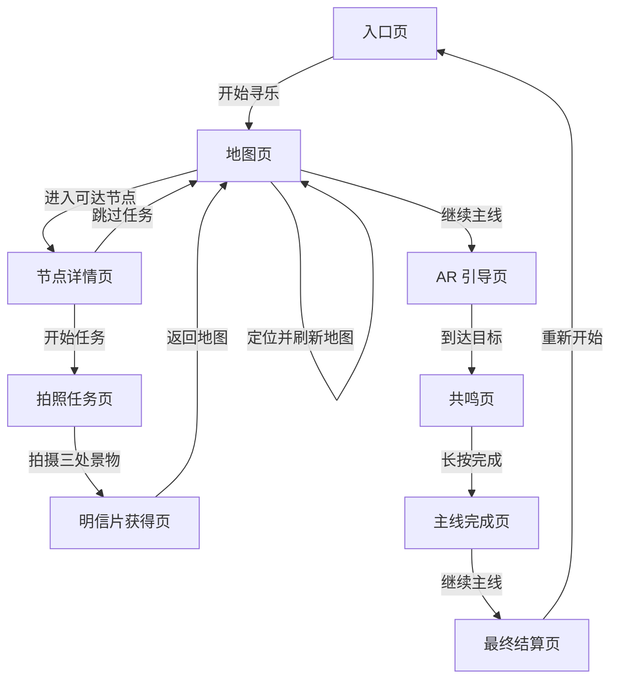

---
tags:
  - xiang-river
  - prototype
  - ux-map
---

# 定位地图与节点任务用户体验地图

## 目标

把当前“所有内容堆在一个主卡片里”的原型，拆成更清晰的页面跳转体验。用户应该先理解自己在哪个页面、下一步要做什么，再决定是否进入节点任务、AR 引导或主线推进。

本轮前端调整建议：撤掉顶部横向进度条，不再用 7 段条表达流程。改用页面标题、状态标签、主按钮、返回按钮和任务卡片表达当前阶段。

## 页面分级

1. 入口页：介绍体验，点击“开始寻乐”进入地图。
2. 地图页：展示定位状态、节点 marker、节点列表和“继续主线”入口。
3. 节点详情页：说明节点任务、奖励和“开始任务 / 跳过任务”两个选择。
4. 拍照任务页：围绕三处景物拍照，完成后发放明信片。
5. AR 引导页：全屏摄像头、方向提示、声音提示和退出入口。
6. 共鸣页：完成到点确认或长按共鸣动作。
7. 主线完成页：展示完成反馈和继续主线入口。
8. 最终结算页：展示本次旅程结果、明信片结算图、分享和重新开始。

## 推荐跳转

## 界面调整原则

- 撤掉全局进度条，避免它抢走主任务注意力。
- 一个页面只承载一个主要动作，避免地图、节点、API、奖励和结算全部堆在一起。
- 地图页负责“找点”，节点详情页负责“选不选任务”，拍照任务页负责“完成三处景物”。
- 最终结算页只展示结果和明信片，不再展示地图节点列表。

## 下一步前端改造顺序

1. 撤掉 `stage-strip` 进度条。
2. 把地图节点系统从主卡片中提升为独立“地图页”。
3. 把节点任务面板改成“节点详情页 -> 拍照任务页”的两级跳转。
4. 最终结算页只保留结果、明信片和分享。
5. 保留入口到地图、地图到节点、跳过任务、拍照完成、结算展示这些测试。

## 链接

- [[00-原型与交互总览]]
