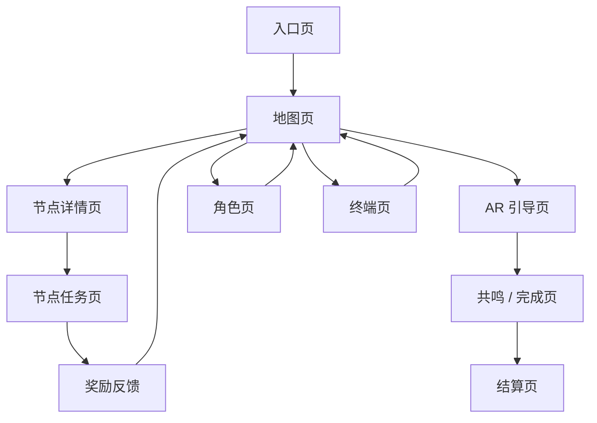

---
tags:
  - xiang-river
  - prototype
  - ui
  - mid-fi
---

# UI 中保真页面原型说明

来源：项目文件 `docs/ui-mid-fi-prototype.md`  
相关：[[00-原型与交互总览]]、[[30-定位地图与节点任务用户体验地图]]、[[04-协作与汇报/30-UI规范文档]]

## 全局页面框架

除首页和 AR 全屏层外，普通页面统一使用：

1. 背景层：暖纸色 + 轻江景纹理。
2. 顶部信息区：模块标签、页面标题、状态标签、说明句。
3. 主内容区：当前页面唯一核心任务。
4. 底部操作区：主按钮 / 次按钮。
5. 固定底部导航：主页、地图、角色、终端。

进入 AR 层后，底部导航隐藏，只保留关闭按钮。

## 页面流

## 页面说明

| 页面 | 页面目标 | 主动作 | 关键状态 |
| --- | --- | --- | --- |
| 入口页 | 让用户知道这是一次橘子洲/湘江文旅小游戏，并开始旅程 | 开始游戏 | 默认、继续旅程不可用 |
| 地图页 | 判断当前位置、可进入节点和下一步路线 | 定位并刷新地图 / 继续主线 | 未定位、定位中、真实定位、无可进入节点、有可进入节点 |
| 节点详情页 | 决定是否参加该节点任务 | 开始节点任务 | 可开始、不可进入、已跳过、已完成 |
| 节点任务页 | 完成当前节点轻量任务并获得奖励 | 拍摄目标 / 返回地图 | 收集中、单项完成、全部完成、退出确认 |
| AR 引导页 | 根据方向提示靠近主线目标区域 | 方向对准 / 关闭 AR | seeking、aligning、locked、lost、权限失败 |
| 共鸣 / 完成页 | 完成到点确认并看到反馈 | 长按共鸣 / 继续主线 | 未按住、按住中、完成 |
| 角色页 | 展示身份、头像、等级、收集进度 | 查看身份与进度 | 默认头像、自定义头像、身份未选、身份已选 |
| 终端页 | 管理玩家信息、成就、明信片收藏和设置 | 编辑资料 / 查看收藏 | 无成就、有成就、上传失败、有明信片 |
| 最终结算页 | 展示旅程结果并引导分享或复游 | 分享明信片 / 重新开始 | 无奖励、有奖励、分享成功、分享失败 |

## 中保真检查清单

- 每页都有明确标题和状态标签。
- 每页只有一个最强主动作。
- 返回路径始终可见或可推断。
- 小屏 360px 下按钮文字不换行挤压。
- 任务完成前后页面状态明显不同。
- AR 页关闭按钮始终在右上角可点击。
- 结算页不再展示复杂地图列表，只展示结果和分享。

## Links

- [[00-原型与交互总览]]
- [[30-定位地图与节点任务用户体验地图]]
- [[04-协作与汇报/30-UI规范文档]]
- [[04-协作与汇报/31-UI组件清单与前端拆分计划]]

